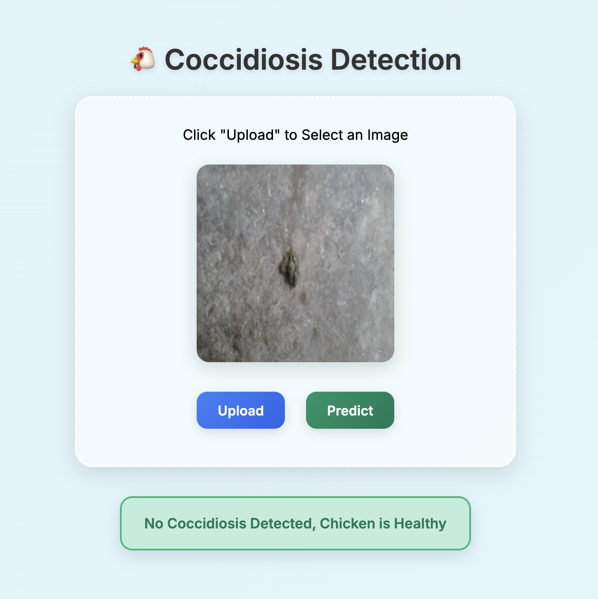

<h1 align="center" style="font-size:2.5em;">🦠 Coccidiosis Disease Classification</h1>

<p align="center" style="font-size:1.3em;">
<b>End-to-end, production-ready deep learning pipeline for automated detection of Coccidiosis in chicken fecal images.<br>
Hosted on <span style="color:#FF9900;">AWS</span> with CI/CD, DVC, and modern MLOps best practices.</b>
</p>

---

<h2 style="font-size:1.5em;">❓ What is Coccidiosis?</h2>

<blockquote style="font-size:1.1em; background:#f9f9f9; border-left:5px solid #4F8A10; padding:1em;">
<b>Coccidiosis</b> is a parasitic disease affecting the intestinal tract of poultry, caused by protozoa of the genus <i>Eimeria</i>. Early and accurate detection is crucial to prevent outbreaks and economic losses in the poultry industry.
</blockquote>

---

<h2 style="font-size:1.5em;">🌟 Project Highlights</h2>

<ul style="font-size:1.1em;">
   <li><b>Automated, end-to-end pipeline</b> for data ingestion, model training, evaluation, and deployment</li>
   <li><b>Hosted on AWS</b> for scalable, real-world inference</li>
   <li><b>CI/CD with GitHub Actions</b> for robust, automated deployments</li>
   <li><b>Modern MLOps</b> with DVC for data & model versioning</li>
   <li><b>Flask web app</b> for real-time predictions</li>
   <li><b>Modular, maintainable codebase</b> with clear pipeline stages</li>
</ul>

---

---

<h2 style="font-size:1.5em;">🌐 Project Links</h2>

- <b>Live Demo:</b> <a href="http://13.51.174.117:8080/" target="_blank">View Project</a>
- <b>Use this if that is not working :</b> <a href="http://ec2-13-51-174-117.eu-north-1.compute.amazonaws.com:8080/" target="_blank">Alternate Link</a>
- <b>LinkedIn:</b> <a href="https://www.linkedin.com/in/jainlakshit/" target="_blank">Lakshit Jain</a>

---

---

<h2 style="font-size:1.5em;">🚀 Tech Stack</h2>

- **Python 3.8+**
- **TensorFlow / Keras**
- **DVC** (Data Version Control)
- **PyYAML**
- **Flask** (for deployment)
- **Logging & Utilities**
- **Jupyter Notebooks** (for experimentation)
- **Git & GitHub Actions** (CI/CD)

---

<h2 style="font-size:1.5em;">🏗️ Project Structure</h2>

```
Coccidiosis-Disease-Classification/
│
├── config/                # YAML configuration files
├── research/              # Jupyter notebooks for experiments
├── src/
│   └── coccidiosisDiseaseClassification/
│       ├── components/    # Core pipeline components
│       ├── config/        # Configuration management
│       ├── constants/     # Constant values
│       ├── entity/        # Data classes for configs
│       ├── pipeline/      # Pipeline stage scripts
│       ├── utils/         # Utility functions
│
├── templates/             # Web app templates
├── dvc.yaml               # DVC pipeline definition
├── params.yaml            # Model & training parameters
├── requirements.txt
├── setup.py
└── README.md
```

---

<h2 style="font-size:1.5em;">🔬 Pipeline Stages</h2>

<ol style="font-size:1.1em;">
   <li><b>Data Ingestion</b>: Downloads and extracts raw data from remote sources.</li>
   <li><b>Prepare Base Model</b>: Loads and customizes a pre-trained CNN (e.g., VGG16) for transfer learning.</li>
   <li><b>Training</b>: Trains the model with data augmentation, callbacks, and DVC tracking.</li>
   <li><b>Evaluation</b>: Evaluates model performance, logs metrics, and generates reports.</li>
   <li><b>Prediction (Deployment)</b>: Flask API for real-time inference, hosted on AWS.</li>
</ol>

---

<h2 style="font-size:1.5em;">⛓️ Pipeline DAG</h2>

<p align="center">
   
</p>

---

<h2 style="font-size:1.5em;">🧠 Model Architecture</h2>

<p align="center">
   
</p>

---

<h2 style="font-size:1.5em;">🖼️ Example Images</h2>

<p align="center">
   
   
   
   
</p>

---

<h2 style="font-size:1.5em;">⚙️ How to Run</h2>

1. **Clone the repository**

   ```bash
   git clone https://github.com/lakshitcodes/Coccidiosis-Disease-Classification.git
   cd Coccidiosis-Disease-Classification
   ```

2. **Install dependencies**

   ```bash
   pip install -r requirements.txt
   ```

3. **Run the pipeline**

   ```bash
   python3 main.py
   ```

4. **Start the web app**
   ```bash
   python3 app.py
   ```

---

<h2 style="font-size:1.5em;">📁 Configuration</h2>

- **config/config.yaml**: Pipeline and artifact paths
- **params.yaml**: Model hyperparameters

---

<h2 style="font-size:1.5em;">✨ Features</h2>

- Modular, maintainable codebase
- Reproducible experiments with DVC
- Automated logging and error handling
- Easy deployment with Flask
- Extensible for other image classification tasks

---

<h2 style="font-size:1.5em;">🤝 Contributing</h2>

Pull requests are welcome! For major changes, please open an issue first.

---

<h2 style="font-size:1.5em;">📜 License</h2>

This project is licensed under the MIT License.

---
